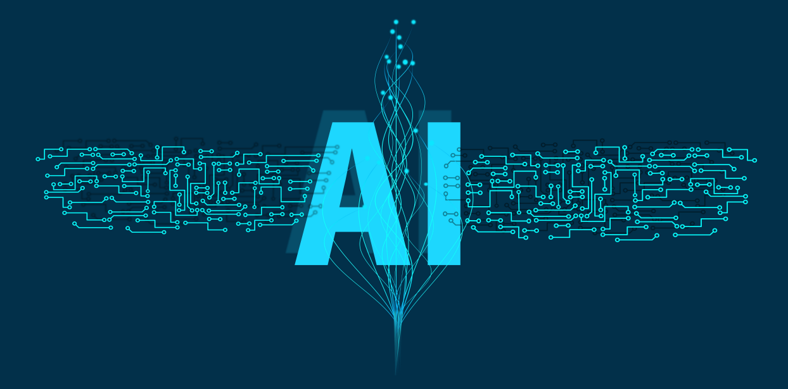

# AI_MEDIA - 智能内容创作与分发系统

 <!-- 建议添加项目横幅图 -->

## 🚀 项目简介
AI_MEDIA是新一代智能媒体内容生产系统，通过大语言模型实现：
- **智能内容生成**：基于新闻/网页链接自动创作优质文章
- **AI视觉增强**：智能匹配高相关性配图
- **全渠道分发**：一键发布至主流自媒体平台
- **全流程自动化**：从内容采集到发布无需人工干预

专为自媒体运营者、内容创作者和数字营销团队打造的生产力工具，每日可节省4+小时内容生产时间！

## ✨ 核心功能
### 1. 智能内容工厂
- 支持URL/关键词/文本片段多种输入方式
- 基于GPT-4/Claude等大模型进行深度内容重构
- 自动生成符合平台调性的多样化文体（新闻/评测/科普等）

### 2. 视觉引擎
- Stable Diffusion/DALL·E 3智能配图生成
- 多模态内容匹配算法
- 自动优化图片尺寸适配各平台规范

### 3. 全平台分发
- 已支持：微信公众平台、今日头条、百家号、知乎
- 即将支持：小红书、抖音、Twitter、Facebook
- 定时发布功能（基于cron表达式）

### 4. 高级功能
- 多账号矩阵管理
- 内容排重检测
- 流量预测算法
- 自动生成标题/话题标签
